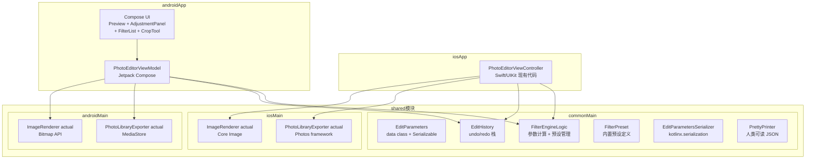

# 设计文档

## 概述

本项目将现有 iOS 照片编辑器（YTPhotoEditorByAI）迁移为 Kotlin Multiplatform（KMP）架构，工程名为 YTPhotoEditorByKMP。目标是通过 KMP 共享模块统一管理业务逻辑，iOS 端复用现有 Swift/UIKit 代码，Android 端使用 Jetpack Compose 实现相同功能。

核心设计决策：
- shared 模块包含所有平台无关的业务逻辑（EditParameters、EditHistory、FilterEngineLogic、序列化），通过 expect/actual 声明平台能力
- iOS 端通过 KMP 生成的 XCFramework 调用 shared 逻辑，保留现有 Swift/UIKit 视图层
- Android 端使用 Jetpack Compose + ViewModel，通过 StateFlow 驱动 UI
- 编辑历史基于参数快照而非图片快照，节省内存，且可在 commonMain 中纯 Kotlin 实现
- 图像渲染为平台 actual 实现：iOS 使用 Core Image，Android 使用 Bitmap API
- 序列化使用 kotlinx.serialization，支持跨平台 JSON round-trip

## 架构



整体分层：
- **commonMain**：纯 Kotlin 业务逻辑，零平台依赖
- **iosMain / androidMain**：平台 actual 实现（图像渲染、相册访问）
- **iosApp**：现有 Swift/UIKit 视图层，通过 XCFramework 调用 shared
- **androidApp**：Jetpack Compose UI 层，通过 ViewModel 调用 shared

## 组件与接口

### shared / commonMain

#### EditParameters

```kotlin
@Serializable
data class EditParameters(
    val exposure: Float = 0f,      // -100 ~ +100
    val contrast: Float = 0f,
    val highlights: Float = 0f,
    val shadows: Float = 0f,
    val saturation: Float = 0f,
    val vibrance: Float = 0f,
    val warmth: Float = 0f,
    val sharpness: Float = 0f,
    val cropRect: CropRect? = null,
    val rotationCount: Int = 0     // 0-3，顺时针 90° 次数
) {
    val isDefault: Boolean get() = this == EditParameters()
}

@Serializable
data class CropRect(val x: Float, val y: Float, val width: Float, val height: Float)
```

#### EditHistory

```kotlin
class EditHistory {
    val canUndo: Boolean get() = undoStack.isNotEmpty()
    val canRedo: Boolean get() = redoStack.isNotEmpty()

    fun push(parameters: EditParameters)
    fun undo(): EditParameters?
    fun redo(): EditParameters?
    fun clear()
}
```

#### FilterEngineLogic

参数计算与预设管理，不含图像渲染。

```kotlin
class FilterEngineLogic {
    val builtinPresets: List<FilterPreset>

    /** 将预设参数合并到当前 EditParameters */
    fun applyPreset(preset: FilterPreset, current: EditParameters): EditParameters

    /** 移除预设，恢复到 baseParameters */
    fun removePreset(base: EditParameters): EditParameters

    /** 将参数值映射到平台渲染所需的归一化值（0.0~1.0 或具体范围） */
    fun mapToRenderParams(parameters: EditParameters): RenderParams
}

data class RenderParams(
    val exposure: Float,    // CIExposureAdjust / Bitmap 映射值
    val contrast: Float,
    val highlights: Float,
    val shadows: Float,
    val saturation: Float,
    val vibrance: Float,
    val warmth: Float,
    val sharpness: Float
)
```

#### FilterPreset

```kotlin
@Serializable
data class FilterPreset(
    val id: String,
    val name: String,
    val parameters: EditParameters
)
```

内置预设（至少 10 个）在 `FilterEngineLogic` 中定义，涵盖：鲜艳、暖色、冷色、黑白、复古、褪色、电影感、清新、日落、胶片。

#### EditParametersSerializer

```kotlin
object EditParametersSerializer {
    fun serialize(parameters: EditParameters): String   // JSON 字符串
    fun deserialize(json: String): Result<EditParameters>
    fun prettyPrint(parameters: EditParameters): String // 格式化 JSON
}
```

#### expect 声明（平台能力）

```kotlin
// commonMain
expect class ImageRenderer {
    fun renderPreview(parameters: EditParameters, sourceImage: PlatformImage, targetSize: Size): PlatformImage?
    fun renderFullResolution(parameters: EditParameters, sourceImage: PlatformImage): PlatformImage?
}

expect class PhotoLibraryExporter {
    suspend fun export(image: PlatformImage, format: ExportFormat, quality: Int): Result<Unit>
}

expect class PlatformImage  // iOS: UIImage/CIImage wrapper, Android: Bitmap wrapper

enum class ExportFormat { JPEG, PNG }
data class Size(val width: Int, val height: Int)
```

### iosApp（Swift/UIKit）

复用现有 `PhotoEditorViewController`，通过 XCFramework 调用 shared 逻辑：

```swift
// 通过 KMP 生成的 Objective-C 接口调用
class PhotoEditorViewController: UIViewController {
    private let editHistory: EditHistory        // KMP shared
    private let filterEngine: FilterEngineLogic // KMP shared
    private let serializer: EditParametersSerializer // KMP shared
    private let imageRenderer: ImageRenderer    // iosMain actual
    private let exporter: PhotoLibraryExporter  // iosMain actual

    // 现有 UI 方法保持不变，业务逻辑委托给 shared
    func updateParameter(_ key: AdjustmentKey, value: Float)
    func applyFilter(_ preset: FilterPreset)
    func undo()
    func redo()
    func exportPhoto(format: ExportFormat, quality: Int)
}
```

如存在命名冲突，shared 模块通过 `@ObjCName` 注解提供兼容名称。

### androidApp（Jetpack Compose）

```kotlin
class PhotoEditorViewModel(
    val editHistory: EditHistory,
    val filterEngine: FilterEngineLogic,
    val imageRenderer: ImageRenderer,
    val exporter: PhotoLibraryExporter
) : ViewModel() {
    val uiState: StateFlow<PhotoEditorUiState>

    fun updateParameter(key: AdjustmentKey, value: Float)
    fun applyPreset(preset: FilterPreset)
    fun removePreset()
    fun applyCrop(cropRect: CropRect, rotationCount: Int)
    fun undo()
    fun redo()
    fun exportPhoto(format: ExportFormat, quality: Int)
}

data class PhotoEditorUiState(
    val parameters: EditParameters = EditParameters(),
    val previewImage: Bitmap? = null,
    val canUndo: Boolean = false,
    val canRedo: Boolean = false,
    val activePreset: FilterPreset? = null,
    val isExporting: Boolean = false,
    val isLoading: Boolean = false,
    val error: String? = null
)
```

Compose UI 组件树：

```
PhotoEditorScreen
├── ImagePreviewArea        // 预览图 + 加载指示器
├── FilterPresetRow         // 水平滚动滤镜列表
├── ToolTabBar              // 光效 / 颜色 / 效果 / 细节
├── AdjustmentPanel         // 滑块列表，按 tab 分组
└── CropOverlay             // 裁剪模式覆盖层
```

## 数据模型

### AdjustmentKey

```kotlin
enum class AdjustmentKey {
    EXPOSURE, CONTRAST, HIGHLIGHTS, SHADOWS,
    SATURATION, VIBRANCE, WARMTH, SHARPNESS;

    val tabGroup: ToolTab get() = when (this) {
        EXPOSURE, CONTRAST, HIGHLIGHTS, SHADOWS -> ToolTab.LIGHT
        SATURATION, VIBRANCE, WARMTH -> ToolTab.COLOR
        SHARPNESS -> ToolTab.DETAIL
    }
}

enum class ToolTab { LIGHT, COLOR, EFFECTS, DETAIL }
```

### AspectRatio

```kotlin
enum class AspectRatio(val ratio: Float?) {
    FREE(null),
    SQUARE(1f),
    FOUR_THREE(4f / 3f),
    THREE_TWO(3f / 2f),
    SIXTEEN_NINE(16f / 9f)
}
```

### Gradle 模块结构

```
YTPhotoEditorByKMP/
├── shared/
│   ├── src/commonMain/kotlin/...
│   ├── src/commonTest/kotlin/...   ← PBT 测试在此
│   ├── src/iosMain/kotlin/...
│   └── src/androidMain/kotlin/...
├── androidApp/
│   └── src/main/...               ← Compose UI + ViewModel
└── iosApp/
    └── ...                        ← 现有 Swift/UIKit 代码
```

依赖：
- `org.jetbrains.kotlinx:kotlinx-serialization-json`
- `io.kotest:kotest-property` (commonTest)
- `org.jetbrains.kotlin:kotlin-test` (commonTest)
- Android: `androidx.lifecycle:lifecycle-viewmodel-compose`, `androidx.compose.*`


## 正确性属性

*正确性属性是系统在所有有效执行中都应保持为真的特征或行为——本质上是关于系统应该做什么的形式化声明。属性是人类可读规范与机器可验证正确性保证之间的桥梁。*

### Property 1：EditParameters 默认值不变量

*For any* 通过默认构造函数创建的 EditParameters，所有调整参数（exposure、contrast、highlights、shadows、saturation、vibrance、warmth、sharpness）的值 SHALL 为 0，rotationCount SHALL 为 0，cropRect SHALL 为 null。

**Validates: Requirements 3.2**

### Property 2：EditHistory push 增长不变量

*For any* EditHistory 实例和任意 EditParameters 序列，每次调用 push 后 canUndo SHALL 为 true，且连续 push n 次后可以连续 undo n 次。

**Validates: Requirements 3.6, 6.1**

### Property 3：undo-redo round-trip

*For any* 非空的 EditHistory，对任意已 push 的 EditParameters 执行 undo 然后 redo，SHALL 返回 undo 之前的 EditParameters（值相等）。

**Validates: Requirements 6.2, 6.3**

### Property 4：undo 后 push 清除 redo 历史

*For any* EditHistory 状态，执行至少一次 undo 后再 push 新的 EditParameters，canRedo SHALL 为 false。

**Validates: Requirements 6.8**

### Property 5：滤镜应用同步参数

*For any* FilterPreset 和任意初始 EditParameters，调用 FilterEngineLogic.applyPreset 后，返回的 EditParameters 中各调整参数值 SHALL 等于该 FilterPreset.parameters 中对应的值。

**Validates: Requirements 4.4**

### Property 6：滤镜应用-移除 round-trip

*For any* 初始 EditParameters 和任意 FilterPreset，先调用 applyPreset 再调用 removePreset，SHALL 恢复到初始的 EditParameters（值相等）。

**Validates: Requirements 4.6**

### Property 7：宽高比约束正确性

*For any* 非 FREE 的 AspectRatio 和任意正数宽高值，经过宽高比约束计算后，结果的 width / height SHALL 等于该 AspectRatio 的预设比例（误差在 1e-4 以内）。

**Validates: Requirements 5.3**

### Property 8：旋转 round-trip

*For any* 初始 rotationCount（0-3），连续执行 4 次顺时针旋转 90° 后，rotationCount SHALL 回到初始值（mod 4 语义）。

**Validates: Requirements 5.4**

### Property 9：裁剪取消恢复状态

*For any* 进入裁剪模式前的 EditParameters，在裁剪模式中进行任意修改后取消，SHALL 恢复到进入前的 EditParameters（值相等）。

**Validates: Requirements 5.6**

### Property 10：EditParameters 序列化 round-trip

*For any* 有效的 EditParameters（所有参数值在 -100 到 +100 范围内），调用 EditParametersSerializer.serialize 后再调用 deserialize，SHALL 产生与原始值相等的 EditParameters。

**Validates: Requirements 9.1, 9.2, 9.3**

### Property 11：PrettyPrinter 输出包含所有字段

*For any* 有效的 EditParameters，调用 EditParametersSerializer.prettyPrint 后，输出字符串 SHALL 是合法的 JSON，且包含所有调整参数的字段名（exposure、contrast、highlights、shadows、saturation、vibrance、warmth、sharpness）。

**Validates: Requirements 9.4**

## 错误处理

| 场景 | 处理方式 |
|------|---------|
| 照片加载失败 | 平台层显示错误弹窗，提供"重试"和"选择其他照片"选项 |
| 图像渲染失败（actual 实现） | 返回 null/Result.failure，平台层回退到上一个有效预览 |
| 导出渲染失败 | Export_Manager 返回 Result.failure 含失败原因，平台层展示给用户 |
| 相册保存权限被拒绝 | 平台层引导用户前往系统设置开启权限 |
| 无效 JSON 反序列化 | EditParametersSerializer.deserialize 返回 Result.failure，不抛出未处理异常 |
| 内存警告（iOS） | iosMain ImageRenderer 释放预览缓存，降低预览分辨率 |
| KMP API 命名冲突（iOS） | 通过 @ObjCName 注解提供兼容的 Objective-C 名称 |

## 测试策略

### 属性测试（Property-Based Testing）

使用 [kotest-property](https://kotest.io/docs/proptest/property-based-testing.html) 在 `shared/src/commonTest` 中实现所有属性测试，配合 `kotlin-test`。

每个属性测试配置为至少运行 **100 次迭代**（`PropTestConfig(iterations = 100)`）。每个测试用注释标注对应的设计文档属性编号。

标注格式：`// Feature: kmp-photo-editor, Property {number}: {property_text}`

属性测试覆盖范围（对应上方正确性属性）：

| 属性 | 测试内容 | 生成器 |
|------|---------|--------|
| Property 1 | EditParameters 默认值 | 无需生成器（固定示例） |
| Property 2 | EditHistory push/undo 计数 | `Arb.list(arbEditParameters)` |
| Property 3 | undo-redo round-trip | `Arb.list(arbEditParameters, 1..20)` |
| Property 4 | undo 后 push 清除 redo | `arbEditParameters` |
| Property 5 | 滤镜应用同步参数 | `Arb.element(builtinPresets)` + `arbEditParameters` |
| Property 6 | 滤镜应用-移除 round-trip | `Arb.element(builtinPresets)` + `arbEditParameters` |
| Property 7 | 宽高比约束 | `Arb.element(AspectRatio.entries.filter { it != FREE })` + `Arb.positiveFloat()` |
| Property 8 | 旋转 round-trip | `Arb.int(0..3)` |
| Property 9 | 裁剪取消恢复 | `arbEditParameters` + `arbCropRect` |
| Property 10 | 序列化 round-trip | `arbEditParameters` |
| Property 11 | PrettyPrinter 输出合法 JSON | `arbEditParameters` |

自定义生成器示例：

```kotlin
val arbFloat100 = Arb.float(-100f, 100f)
val arbEditParameters = arbitrary {
    EditParameters(
        exposure = arbFloat100.bind(),
        contrast = arbFloat100.bind(),
        highlights = arbFloat100.bind(),
        shadows = arbFloat100.bind(),
        saturation = arbFloat100.bind(),
        vibrance = arbFloat100.bind(),
        warmth = arbFloat100.bind(),
        sharpness = arbFloat100.bind(),
        rotationCount = Arb.int(0, 3).bind()
    )
}
```

### 单元测试

使用 `kotlin-test` 在 `commonTest` 中覆盖：
- 具体滤镜预设应用示例（验证特定预设的参数值）
- 内置预设数量 ≥ 10（Property 4.1 example）
- 空历史的 undo/redo 返回 null
- 无效 JSON 反序列化返回 Result.failure（edge-case 9.5）
- 导出质量参数边界值（1 和 100）
- AspectRatio 枚举包含所有预设比例（FREE、1:1、4:3、3:2、16:9）

### 平台测试

- **iOS**：使用 XCTest 测试 `ImageRenderer` actual 实现（Core Image 滤镜链参数映射）
- **Android**：使用 JUnit4 + Robolectric 测试 `PhotoEditorViewModel` 状态流转

### 测试互补性

- 单元测试：验证具体示例、边界条件和错误场景
- 属性测试：通过随机生成验证跨所有输入的通用属性
- 两者互补，共同提供全面覆盖；属性测试处理大量输入覆盖，单元测试聚焦具体行为
